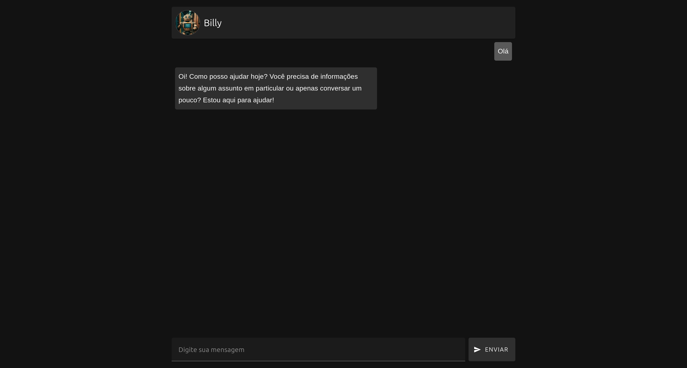

<h1>Billy LLM</h1>

___
Utilize a Api e Ui para estudos e testes com a LLM.

### UI
A UI é feita de forma simples utilizando Vue e Vuetify.

## Contribuição

Fique à vontade para contribuir com este projeto, adicionando conhecimento, melhorias e novas funcionalidades para apoiar o estudo de LLM.